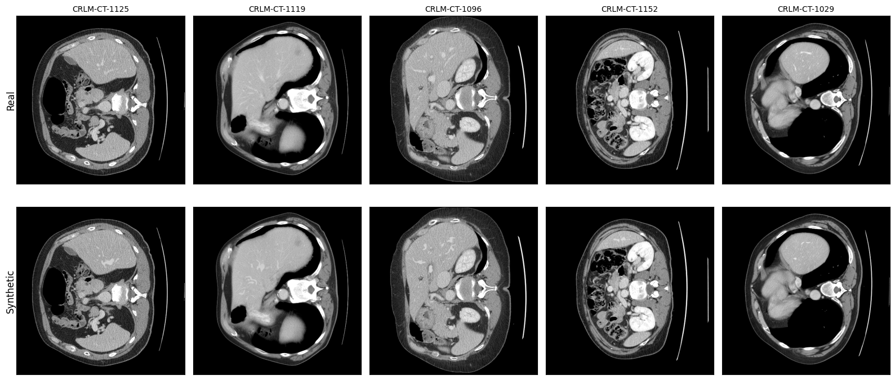
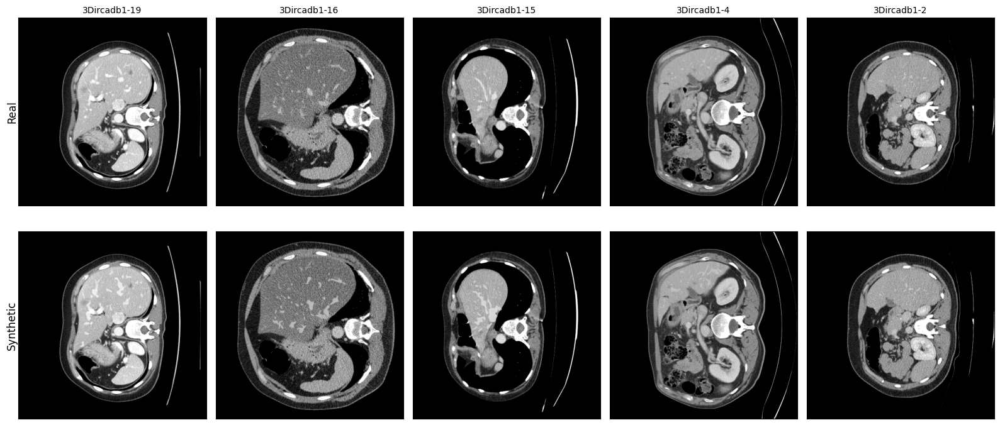

# Synthetic Hepatic Vessels

This repository contains the code and datasets used for the thesis project: **"Generador de datos sintéticos para la segmentación de venas hepáticas en imágenes médicas"**. The thesis addresses the challenge of limited annotated datasets for hepatic vessel segmentation by proposing a method to generate synthetic data using inpainting techniques, autoencoders, and morphological operations. The method enables training deep learning models with improved segmentation performance in data-constrained scenarios.

## Datasets

Datasets used in this project:
1. [Colorectal and 3D-IRCADb Datasets in HDF5 format](https://drive.google.com/file/d/1FTMLB06NshHWCEBE7y4Rg7OnNiPPAF3p/view?usp=sharing)
2. [Synthetic Colorectal and 3D-IRCADb Datasets in HDF5 format](https://drive.google.com/file/d/1KcWCvGoVDVoA44xMitbrb1-NTXbHmjHS/view?usp=sharing)

The dataset used in this project is stored in an HDF5 file, structured hierarchically for efficient access. Below is a detailed explanation of its contents and format:

### Structure
The dataset is organized by patient IDs. Each patient contains multiple slices categorized as follows:
```
HDF5 File
└── Patient_ID
    ├── image
        ├── slice_0
        ├── slice_1
        └── ...
    ├── mask
        ├── slice_0
        ├── slice_1
        └── ...
    ├── image_fake
        ├── slice_0
        ├── slice_1
        └── ...
    └── image_inpaint
        ├── slice_0
        ├── slice_1
        └── ...
```


### Content
1. **`image`**: Grayscale CT images, which can be **Real** or **Synthetic**.
   - Synthetic images are identified by patient IDs prefixed with `synthetic_`. For example, `synthetic_CRLM-001` indicates a synthetic dataset derived from the patient `CRLM-001`.

2. **`mask`**: Binary segmentation masks for the hepatic vessels.

3. **`image_fake`**: Input images used exclusively to train the autoencoder. These are not the synthetic images.

4. **`image_inpaint`**: Grayscale CT slices where hepatic vessels have been removed using inpainting. These serve as the background for generating new synthetic images.

### Example Generated Images:
- **Colorectal Synthetic Examples**  


- **3D-IRCADb Synthetic Examples**  


## Cite
Please cite these works if you use our code or dataset:
```bibtex
@mastersthesis{Aros2024SyntheticHepaticVessels,
  author       = {Luis Aros, Matías Daudet and Ángel Pérez},
  title        = {Synthetic Data Generator for Hepatic Vessel Segmentation in Medical Images},
  school       = {Universidad Adolfo Ibáñez},
  year         = {2024},
  type         = {Master's thesis},
  month        = {December}
}
```
Feel free to [contact us](mailto:synthetic.hepatic.vessels@gmail.com).